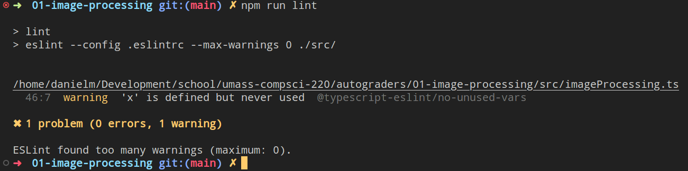

# Editing

## Index

- [Opening an Assignment in VSCode](#opening-an-assignment-in-vscode)
- [Linting and Formatting Assignments](#linting-and-formatting-assignments)
  - [Linting](#linting)
  - [Formatting](#formatting)

## Opening an Assignment in VSCode

1. Open your file browser and navigate to your CS220 folder

- If you do not already have a CS220-specific folder, you should make one so all your files are grouped together. Place it somewhere easy to remember.

2. Inside your CS220 folder, create a new folder for the assignment.

3. Download the provided ZIP file and place it inside the newly created assignment folder.

- If you'd like to open the empty assignment, download [this ZIP](../../practice-assignments/01-empty-assignment/01-empty-assignment.zip).

4. Right-click the ZIP archive and extract the contents into the folder.

5. Open VSCode, click on `File -> Open Folder...`, then navigate to the extracted contents.

6. Once you see the contents of the assignment (the folder containing a `package.json`), click `Open`.

7. Inside of VSCode, click on the explorer (top of the left sidebar) if it is not already revealed. You should see an `src/` and `.vscode/` folder, `package.json` and `package-lock.json` files, and some other configuration files. If you do not, then you have opened the wrong folder.

- After opening the folder, you may have received a notification on the bottom right of your screen prompting you to install some extensions. It is recommended that you do.

8. Create a new terminal in VSCode, click on `Terminal -> New Terminal`. You should see a box on the bottom open up. This terminal is where you will execute commands to run, debug, test, and build assignments. **TIP: Use the up/down arrow keys to cycle through command history so you do not have to rewrite commands.**

9. Inside the terminal, type the command `npm i` (shorthand for `npm install`), then press enter. You should see some output that mentions the dependencies being installed. After it has finished, you should see a new `node_modules/` folder in the explorer.

Congratulations, you have successfully opened an assignment! The next step would be to [run the assignment](./RUNNING_AND_DEBUGGING.md#running-an-assignment-in-vscode).

## Linting and Formatting Assignments

Assignments come configured with linting and formatting. Provided for you are the `npm run lint`, `npm run lint:fix`, and `npm run format` commands.

### Linting

From [Wikipedia on Lint](<https://en.wikipedia.org/wiki/Lint_(software)>):

> Lint, or a linter, is a static code analysis tool used to flag programming errors, bugs, stylistic errors and suspicious constructs. The term originates from a Unix utility that examined C language source code.

Homework assignments will require that you do not have any linter errors. To check your linter warnings, run the `npm run lint` command in a terminal. It will produce output detailing where and how your code could improve.

If you do not understand what the warning means, Googling its name may help ("@typescript-eslint/no-unused-vars").

Using the [VSCode ESlint](https://marketplace.visualstudio.com/items?itemName=dbaeumer.vscode-eslint) extension will bring these warnings into the editor visually. Allowing you to hover your cursor over them and interact with them.

The `npm run lint:fix` command will attempt to fix all the automatically fixable warnings. Such as using `let` for a variable that is never reassigned.

<p align="center">
  
</p>

Above is some example output from running `npm run lint`. As you can see, on line 46, column 7, we are getting a warning because we define a variable `x`, but never use it.

### Formatting

Formatting, i.e. the spacing and visual structure of your code, is handled before you build your final submission using the `npm run format` command. If you'd like, you can run this command periodically to format your code. Alternatively, you could configure VSCode to automatically format your code whenever you save your file.

Installing the [Prettier extension](https://marketplace.visualstudio.com/items?itemName=esbenp.prettier-vscode) in VSCode and adding the following to your `settings.json` (`File -> Preferences -> Settings -> Open JSON (top right)`) should configure it for you:

```json
"[typescript]": {
  "editor.defaultFormatter": "esbenp.prettier-vscode"
},
"editor.formatOnSave": true
```

Your code is formatted before you build your submission so it can be more easily read by course staff.
