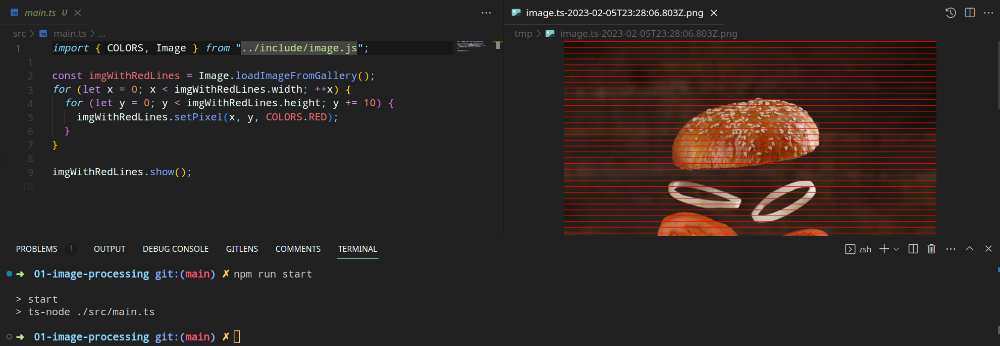

# Running and Debugging

## Index

- [Running an Assignment in VSCode](#running-an-assignment-in-vscode)
- [Debugging in VSCode](#debugging-in-vscode)

## Running An Assignment in VSCode

Assignments do not have main methods, but they do have `main.ts` files. This is the "entry point" of your program. To run it, simply use the `npm run start` command in your assignments terminal (open up the assignment folder, `Terminal -> New Terminal`).

  

Above is an example run of a working solution for the first homework.

## Debugging in VSCode

From [Wikipedia on Debuggers](https://en.wikipedia.org/wiki/Debugger)

> A debugger or debugging tool is a computer program used to test and debug other programs (the "target" program). The main use of a debugger is to run the target program under controlled conditions that permit the programmer to track its execution and monitor changes in computer resources that may indicate malfunctioning code.

If you have never used a debugger before, then now is a great time to start. They are extremely useful and can help you save a lot of time.

Provided with each assignment is a VSCode launch configuration to debug your code (`.vscode/launch.json`). To start your debugging your application from `main.ts`, use `Run -> Debug main`. This means that VSCode will run your `main.ts` file and suspend execution if it hits a breakpoint or [debugger statement](https://developer.mozilla.org/en-US/docs/Web/JavaScript/Reference/Statements/debugger). To debug your tests, use `Run -> Debug tests`.

If you are not familiar with how to use a debugger, then watching some of these videos may help:

- [How to use a Debugger (17m00s)](https://www.youtube.com/watch?v=7qZBwhSlfOo)
- [How to use the Debugger in VSCode to debug Node.js Applications (11m40s)](https://www.youtube.com/watch?v=7qZBwhSlfOo)

If you would like to debug a specific test, see the [testing document](./TESTING.md#running-and-debugging-tests).
