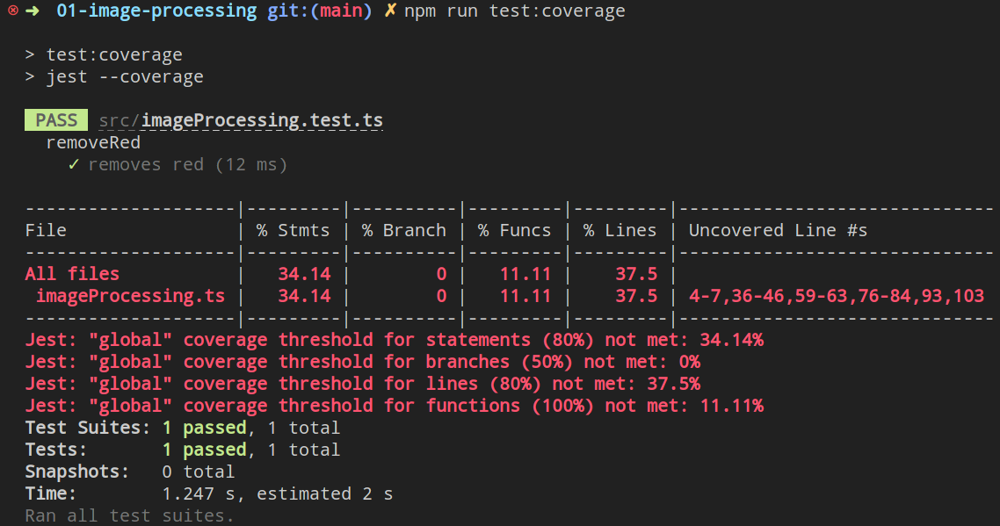

# Testing

## Index

- [Writing Tests](#writing-tests)
  - [Assertions](#assertions)
  - [jest](#jest)
- [Running and Debugging Tests](#running-and-debugging-tests)

## Writing Tests

### Assertions

Anywhere in your code, you can write statements called "assertions" using the `assert` function. You can import the `assert` statement from the Node.js standard library like so:

```ts
import assert from "node:assert";
```

An assertion is a logical statement that you are verifying (asserting) to be true at execution, if that statement is false, assert will throw an error with an optional message. If the statement is true, then `assert` will do nothing. This is useful for writing preconditions for various functions:

```ts
function sqrt(x: number): number {
  assert(x >= 0, "sqrt is only defined for positive numbers");

  // code to calculate the square root
}
```

Inside your tests, you can use assertions to verify function results (actual results) to results you expect (expected results).

### jest

To test your homework code, we will be using the [jest testing framework](https://jestjs.io/), which will provide an interface to describe tests, manage their execution, and give a detailed report when they fail. Jest has a series of global functions that you will use to mock up your tests. The two functions we care about are `describe` and `test` (alternatively called `it`).

We use `describe(name: string, fn: () => void)` to create a block that groups together several related tests. We use `it(name: string, fn: () => void)` (same as `test`) to wrap specific assertions about the results of the item we are testing.

```ts
// Describe a series of tests related to the "sqrt" function
describe("sqrt", () => {
  it("correctly calculates root 0", () => {
    // it (sqrt) correctly calculates root 0
    // A logical expression that will do nothing (pass) if we get our expected result,
    // and fail if we do not get our expected result.
    // The provided message will print out if we fail.
    const result = sqrt(0);
    assert(result === 0, `Expected sqrt(0) to be 0, got: ${result}`);
  });

  it("correctly calculates root 1", () => {
    const result = sqrt(1);
    assert(result === 1, `Expected sqrt(1) to be 1, got: ${result}`);
  });
});
```

#### (Optional) Advanced Testing Interface: Using `expect` and Beyond

**Warning: Please do not use the advanced testing interface if you are uncomfortable. Prioritize writing tests that are correct.**

Jest also includes [a function called `expect`](https://jestjs.io/docs/expect). Which is super powerful for describing more complicated scenarios. Such as checking if two numbers are close to each other, rather than strictly equal (`===`):

```ts
it("correctly calculates root 2", () => {
  // asserts that sqrt is less than 0.005 from 1.4142
  expect(sqrt(2)).toBeCloseTo(1.4142);

  // as opposed to

  assert(Math.abs(sqrt(2) - 1.4142) < 0.005);
});
```

You are welcome to use either interface for writing your tests (we recommenced assertions). Here are jest's [documentation](https://jestjs.io/docs/getting-started) and [API](https://jestjs.io/docs/api) if you are interested.

## Running and Debugging Tests

You can run the provided test script by opening a VSCode terminal (`Terminal -> New Terminal`) and running the `npm run test` command. Use `npm run test:coverage` to get coverage results.

<p align="center">
  
</p>

Above, is an example output of the `npm run test:coverage` command. There was only one test written (removeRed removes red), so the homework coverage requirements were not met.

## Coverage

